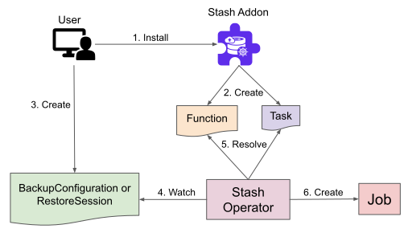

# Stash Addons

Stash 0.9.0+ supports extending its functionality through addons. This guide will give you an overview of what is an addon, how addons work and a list of Stash addons.

## What is an Addon

Stash 0.9.0+ uses two different models for backup/restore based on target types. One of them is **sidecar model** where Stash injects a `sidecar`/`init-container` into the targeted workload for backup/restore. Another is **job model** where backup or restore is done via an external job.

The job model is further divided into two categories. In the first category, the targeted resource is well known to Stash (example, a PVC). Hence, the Stash operator itself can create the required job to backup/restore the target. In the second category, Stash follows `Function-Task` model where the targeted resource is not known to Stash. In this case, the user creates some [Function](/docs/v2023.10.9/concepts/crds/function/) which resembles a step of backup/restore process and a [Task](/docs/v2023.10.9/concepts/crds/task/) which specifies the order of execution of these steps. Stash uses these `Function` and `Task` to generate the required job definition to backup/restore the target.

The `Function-Task` model enables Stash to backup/restore the resources that the operator itself is not aware of. Users can extend Stash by creating respective `Function`, `Task`, and docker images for respective `Function` to backup their desired resources.

A Stash addon is a collection of [Functions](/docs/v2023.10.9/concepts/crds/function/) and a [Task](/docs/v2023.10.9/concepts/crds/task/) to backup & restore a specific resource.

## How Addons Work

When a user installs a Stash addon, it creates some `Function` and `Task` definitions. Then, when he creates a `BackupConfiguration` or `RestoreSession` object to backup/restore his desired resource, Stash operator resolves the `Function` and `Task` to create a Job to backup/restore the target. The following diagram shows how addons works in Stash:

<figure align="center">
  
  <figcaption align="center">Fig: Stash Addon Overview</figcaption>
</figure>

A `Function` is fundamentally a container specification and `Task` specifies the execution order of the containers. Stash operator injects all the containers except last one resolved from the `Function` specified in `Task` as `init-container` into the job in the same order they appear in the `Task`. Then, it injects the last container as the main container of the Job.

## Available Addons

The following addons are available for [Stash Enterprise Edition](/docs/v2023.10.9/setup/install/enterprise/):


