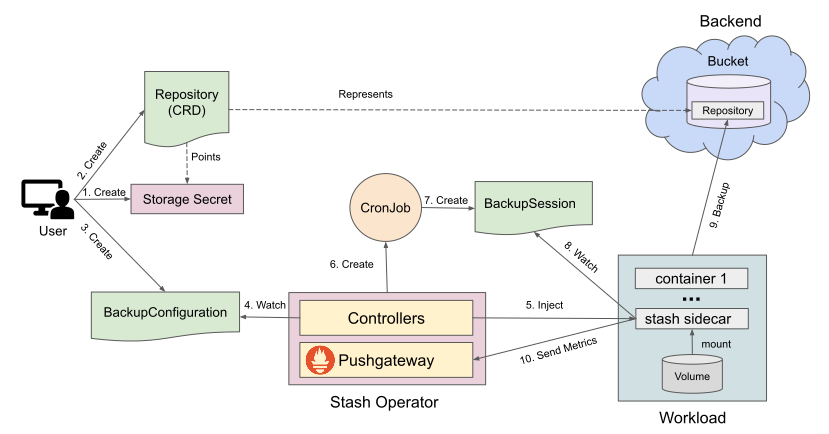
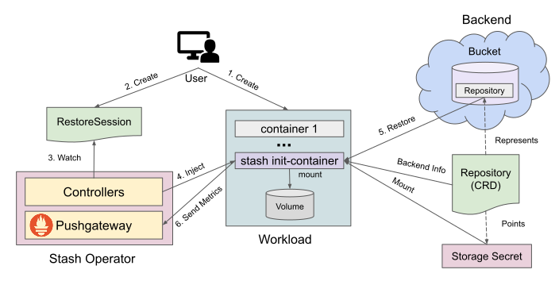

# Backup and Restore Workloads using Stash

This guide will show you how Stash backs up and restores volumes of various workload types (Deployment, StatefulSet, DaemonSet etc.).

## Before You Begin

- You should be familiar with the following `Stash` concepts:
  - [BackupConfiguration](/docs/v2024.4.8/concepts/crds/backupconfiguration/)
  - [BackupSession](/docs/v2024.4.8/concepts/crds/backupsession/)
  - [RestoreSession](/docs/v2024.4.8/concepts/crds/restoresession/)
  - [Repository](/docs/v2024.4.8/concepts/crds/repository/)

## How Backup Process Works

The following diagram shows how Stash takes backup of the volumes of a workload. Open the image in a new tab to see the enlarged version.

<figure align="center">
  
<figcaption align="center">Fig: Backup process of Workload volumes in Stash</figcaption>
</figure>

The backup process consists of the following steps:

1. At first, a user creates a Secret. This secret holds the credentials to access the backend where the backed up data will be stored.

2. Then, she creates a `Repository` crd which represents the original repository in the backend.

3. Then, she creates a `BackupConfiguration` crd which specifies the targeted workload and desired file paths to backup. It also specifies the `Repository` object that holds the backend information where the backed up data will be stored.

4. Stash operator watches for `BackupConfiguration` objects.

5. When it finds a `BackupConfiguration` object, it finds the targeted workload and injects a sidecar named `stash`.

6. It also creates a `CronJob` to trigger backups periodically.

7. The`CronJob` triggers backup on each scheduled slot by creating a `BackupSession` crd.

8. The `stash` sidecar inside the workload watches for `BackupSession` crd.

9. When it finds a `BackupSession` crd, it initiates backup of the targeted file paths.

10. Once the backup process is completed, the `sidecar` sends Prometheus metrics to the Pushgateway running inside the `stash-operator` pod. It also updates respective `BackupSession` and `Repository` status to reflect the backup process.

## How Restore Process Works

The following diagram shows how Stash restores backed up data inside a workload. Open the image in a new tab to see the enlarged version.

<figure align="center">
  
<figcaption align="center">Fig: Restore process of Workload volumes in Stash</figcaption>
</figure>

The restore process consists of the following steps:

1. At first, the user creates a workload where the data will be restored.

2. Then, she creates a `RestoreSession` crd that specifies the targeted workload where the backed up data will be restored. It also specifies the respective `Repository` that holds the respective backend information.

3. Stash operator watches for `RestoreSession` crds.

4. When it finds a `RestoreSession` crd, it injects an init-container named `stash-init` to the workload and restart it.

5. The init-container restores the desired data from the backend on start-up.

6. Finally, when the restore process is completed it sends Prometheus metrics to the `pushgateway` running inside the stash operator. It also update the `RestoreSession` status to reflect the restore process.

> **Note:** If your workload restarts with the `stash-init` init-container for any reason, the init-container will skip running restore process if there is no pending `RestoreSession` for this workload.

## Next Steps

1. See a step by step guide to backup/restore volumes of a Deployment [here](/docs/v2024.4.8/guides/workloads/deployment/).
2. See a step by step guide to backup/restore volumes of a StatefulSet [here](/docs/v2024.4.8/guides/workloads/statefulset/).
3. See a step by step guide to backup/restore a Daemonset's volumes [here](/docs/v2024.4.8/guides/workloads/daemonset/).
