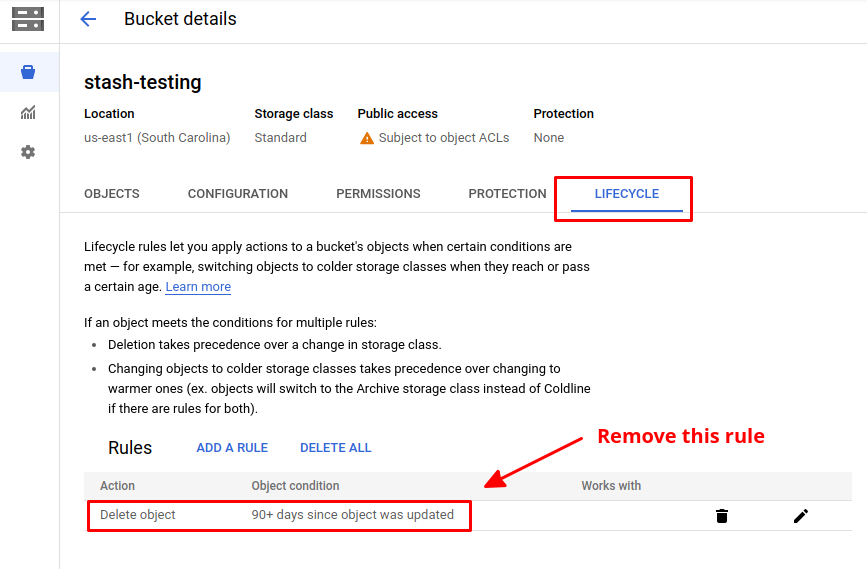

# Troubleshooting "ciphertext verification failed" issue

Sometimes, the backup starts failing after a few days with an error indicating `ciphertext verification failed`. In this guide, we are going to explain what might cause the issue and how to solve it.

## Identifying the issue

The backup should run successfully for a few days. Suddenly, it will start failing. Any subsequent backups will fail too. If you describe the respective `BackupSession` or view the log from the respective backup sidecar/job, you should see the following error:

```bash
Fatal: ciphertext verification failed
```

## Possible reasons

This can happen if the backed-up data get corrupted for any of these reasons.

- Someone deleted some files/folders from the backend manually.
- The respective bucket has a policy configured to delete the old data automatically.

## Solution

At first, check if the bucket has any policy configured to delete the old data automatically. If this is the case, please remove that policy and depend only on the retention policy provided by Stash Repository to cleanup the old data.

For example, if you are using a GCS bucket, you can check for such policy in the `LIFECYCLE` tab.

<figure align="center">
  
<figcaption align="center">Fig: Object deletion policy in GCS</figcaption>
</figure>

Unfortunately, there is no known way to fix the corrupted repository. You have to delete all the corrupted data from the backend. Only then, the subsequent backups will succeed again.
